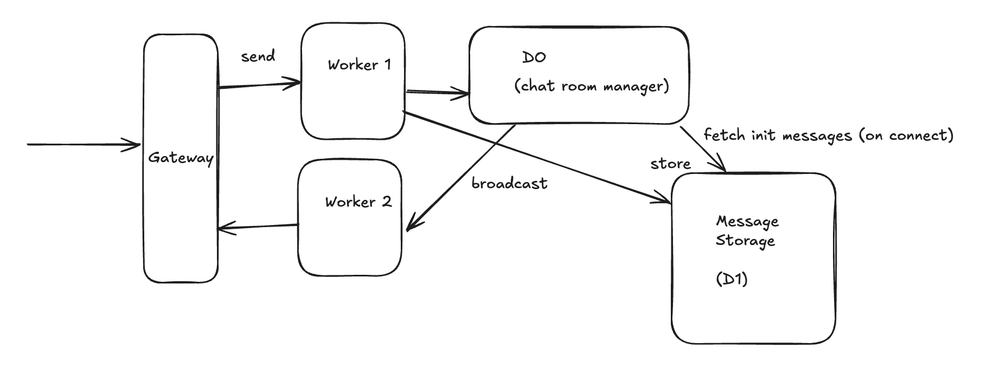

# Buddy 🫂

This repo is a very simple toy-like implementation of private chat rooms based on Cloudflare Durable Objects
and server-side events. The idea was to explore Cloudflare "primitives" and build something with them.

### Project overview 📔



The app has quite simple architecture and consist of the following parts:

- UI
- A worker (API layer)
- Durable Objects - SSE connection handling and message routing
- Storage (D1) - a persistence layer for messages

The UI part is very basic and frankly speaking ugly, but it was not important to the goal of the project.
Traditionally for a chat app backend part would be a containerized application that is deployed on a cloud or on premise, Redis could be used for handling message routing and so on.

However, Cloudflare provides a very interesting building block which is called [Durable Object](https://developers.cloudflare.com/durable-objects/).
I like to think about it as an orchestrator with some persistent state. The cool part, it's not required to
storage at all to use Durable Objects. In fact, for this application the only thing is needed is to route
all users from the same chat room to the same instance of Durable Object.

### How it works❓

Let's walk through the typical workflow in the app. In short, it looks like this:

1. Create a private chat room and get RoomID (which is used like sharable link).
2. Connect e.g. establish SSE connection with a server
3. Send messages

Generating sharable links is quite easy, luckily Durable Objects can generate unique and random ids
which is essentially a 64 character strings. Those ids can be used to identify a chat room, but also
shared as a link to the room.

Now, when a user sends a message the system should also know where to route the message.
And... Durable Objects can help with this too. So, when a client connects to the backend, RoomID is used
to route a request to a specific instance of Durable Object and store/handle connection there.
In this case, Durable Objects keep all connections in memory. This is totally fine and even if for some
reason DO gets destroyed, users can simply reconnect to the same chat.

### Things to know 🤔

So, in case you want to try it running locally, you can clone the repo and execute the following commands:

```
nvm use
cd app
npm install
npm run build
npm run dev
```

One think you might notice is that locally the app doesn't handle request close/abort signals.
That's not a bug, but rather a feature 😅. Locally Cloudflare doesn't support propagating request
signal, hence the event handler for close/abort events never gets executed. I didn't bother to fix this.
